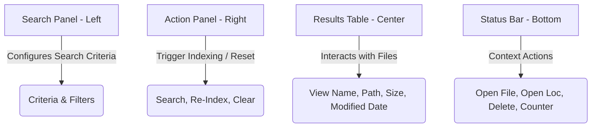

# FileLocator User Guide

Welcome to the **FileLocator** User Guide! This document provides complete instructions on how to use FileLocator, a standalone, lightning-fast file and folder search utility for your computer. 

---

## 📖 Table of Contents
1. [Introduction](#-1-introduction)
2. [System Requirements](#-2-system-requirements)
3. [How to Start the Application](#-3-how-to-start-the-application)
4. [First-Time Launch & Database Setup](#-4-first-time-launch--database-setup)
5. [The Interface at a Glance](#-5-the-interface-at-a-glance)
6. [Searching for Files and Folders](#-6-searching-for-files-and-folders)
7. [Applying Advanced Filters](#-7-applying-advanced-filters)
8. [Managing Your Search Results](#-8-managing-your-search-results)
9. [Understanding the Search Index (Database)](#-9-understanding-the-search-index-database)
10. [Configuration & Custom Themes](#-10-configuration--custom-themes)
11. [Troubleshooting & FAQs](#-11-troubleshooting--faqs)

---

## 🚀 1. Introduction

**FileLocator** is a lightweight, high-performance desktop search utility. It is designed to find files and folders on your computer instantly without sluggish background scans slowing down your machine. 

### Why Use FileLocator?
* **Lightning-Fast Search:** Searches through millions of indexed files in milliseconds.
* **Portable & Standalone:** Runs directly from a single executable file. No installation or administrative privileges required.
* **Enterprise Safe:** Built entirely with standard libraries. It does not install native background services, register DLLs, or modify system registries, making it safe for strict corporate IT environments.
* **No Database Overhead:** Utilizes a highly compressed custom file index rather than heavy SQL database engines.

---

## 💻 2. System Requirements

Before running the application, ensure your computer meets the following requirements:
* **Operating System:** Windows 10/11, macOS, or Linux.
* **Java Runtime:** Java Runtime Environment (JRE) or Java Development Kit (JDK) **Version 17 or higher** must be installed on your computer.

---

## 🏃 3. How to Start the Application

FileLocator is distributed as a single executable JAR file (`file-locator-1.0.0.jar`). 

### Option A: Double-Click (Recommended)
If your computer has Java configured as the default program for `.jar` files:
1. Navigate to the folder containing the `file-locator-1.0.0.jar` file.
2. Double-click the file to open the graphical user interface (GUI).

### Option B: Command Prompt / Terminal
If double-clicking does not launch the app, open your terminal or command prompt and run the following command:
```bash
java -jar file-locator-1.0.0.jar
```

> [!NOTE]
> FileLocator writes its settings and search index in the folder from which you launch it. It is recommended to place the application in its own dedicated directory (e.g., `C:\Tools\FileLocator\`).

---

## 🗃️ 4. First-Time Launch & Database Setup

Since FileLocator performs searches in milliseconds by reading a local database file, it requires a file index to be built on its first run.

1. Upon your first launch, a dialog box will appear stating **"No database found. Would you like to scan 'This PC' (All Drives) now?"**.
2. Click **Yes** to begin the initial indexing scan.
3. The status bar at the bottom will display `Scanning drives... (Please wait)`.
4. Once completed, the index size will be shown (e.g., `Index Complete. Total Items: 450,230`), and you can begin searching immediately.

---

## 🖥️ 5. The Interface at a Glance

The FileLocator window is divided into four main functional areas:



1. **Search Criteria Panel (Top Left):** Organized into three tabs:
   * **Name & Location:** Basic queries, folder selection, and extension filters.
   * **Size and Date:** Filters to restrict files by size and last modified date.
   * **Advanced:** Settings for themes, sorting, duplicate detection, and folders.
2. **Action Panel (Top Right):** Contains quick-action buttons:
   * **Re-Index:** Initiates a fresh scan of the selected drive or folder.
   * **Clear:** Resets all filters, inputs, and search results to their default state.
3. **Search Results Table (Center):** Displays matching files. Columns show the File Name, containing Folder, Size (KB/MB/GB), and Date Modified.
4. **Status Bar (Bottom):** Displays the current operation status (e.g., items found) and provides action buttons (**Open**, **Open Loc**, **Delete**) for the selected file.

---

## 🔍 6. Searching for Files and Folders

To perform a search, configure the parameters in the **Name & Location** tab:

### Basic Search
Type part of the file name into the **Name:** field. The results table will update instantly as you type.

### Search by Extension
Use the **Extensions:** field to filter results by file types. You can supply multiple extensions separated by commas:
* To find text documents: `txt` or `.txt`
* To find multiple document types: `pdf, docx, xlsx`

### Specifying the Search Scope ("Look in")
* **Specific Folder:** Click the **Browse...** button to select a folder. Search results will be restricted to files within that folder.
* **Whole PC:** Select **This PC** from the dropdown menu to search across all mounted drives (e.g., `C:\`, `D:\`).
* **Subdirectory Toggle:** Check the **Search subdirectories** box to search recursively inside all subfolders. Uncheck it to only search within the top level of the selected folder.

### Advanced Query Matching
FileLocator supports specialized notation for precise searching:
* **Exact Matching:** Wrap your search term in single (`'...'`) or double (`"..."`) quotes to find files matching that exact name. E.g., `"Report"` will not match `MonthlyReport.docx`.
* **Wildcards:** Use `*` to represent any sequence of characters, or `?` to represent any single character.
  * `*.xlsx` (finds all Excel files)
  * `budget_202?.csv` (finds `budget_2024.csv`, `budget_2025.csv`, etc.)

---

## ⚙️ 7. Applying Advanced Filters

Use the **Size and Date** and **Advanced** tabs to narrow down large numbers of files:

### File Size Limits
Under the **Size and Date** tab, check the size boxes to enforce limits:
* **Minimum File Size:** Ignores files smaller than the set value.
* **Maximum File Size:** Ignores files larger than the set value.
* Select the unit size drop-down menu (**KB**, **MB**, or **GB**) to configure the target range.

### Date Modified Limits
Filter files depending on when they were last edited:
* **Files newer than:** Only shows files modified on or after the specified date.
* **Files older than:** Only shows files modified on or before the specified date.

### Duplicate File Finder
Under the **Advanced** tab, check **Find Duplicates (Name & Size)**. FileLocator will filter search results to display only files that share the exact same filename and byte size. This is a highly efficient way to find redundant file copies.

### Regex (Regular Expressions)
Check **Use Regular Expressions (Regex)** under the **Advanced** tab if you wish to use advanced text pattern criteria.
* Example: `^img_\d{4}\.png$` (matches files starting with `img_` followed by exactly four digits and ending in `.png`).

---

## 📂 8. Managing Your Search Results

Once your search results are displayed, you can interact with them directly from the app interface:

| Action | Shortcut / Mouse Gesture | Description |
| :--- | :--- | :--- |
| **Open File / Folder** | Double-Click OR Click **Open** | Launches the selected file/folder using the computer's default system program. |
| **Show in Explorer** | Click **Open Loc** | Opens the parent folder in Windows File Explorer and highlights the selected file. |
| **Permanent Deletion** | Press `Delete` key OR Click **Delete** | Permanently deletes the selected file/folder from your computer. Requires verification. |
| **Sort Results** | Click Column Headers OR Advanced tab Sort fields | Sorts results by Name, Size, Date Modified, or Path. |

> [!CAUTION]
> Deletion is permanent. When you delete a folder or file through FileLocator, it is bypassed from the Recycle Bin/Trash and deleted directly from the disk. This cannot be undone.

---

## 🧠 9. Understanding the Search Index (Database)

FileLocator relies on an offline file database rather than checking your hard drive in real-time for every single search. This is why search results appear instantly.

### When to Re-Index?
If you add, rename, or delete files outside of FileLocator (using standard Windows Explorer or other apps), those changes will not be reflected in your search results immediately. Click the **Re-Index** button to refresh the database for your selected search location.

### Smart Background Auto-Indexing
To ensure you don't have to manual re-index constantly, FileLocator has built-in system intelligence:
1. **Idle Scanning:** It periodically checks your computer's CPU usage. If your system is idle (CPU usage is under 15%), it will silently update the search index in the background.
2. **CPU Throttling:** If background scanning is running and you launch a heavy task (causing system CPU usage to exceed 70%), FileLocator immediately throttles/slows down its indexer to keep your system fully responsive.
3. **Excluded Directories:** To speed up performance and prevent permissions errors, FileLocator automatically ignores standard system directories like `C:\Windows`, `C:\Program Files`, and system Recycle Bin folders.

---

## 🎨 10. Configuration & Custom Themes

FileLocator saves user preferences in a file named `user-preferences.json` in the same directory as the executable.

* **Theme Selection:** In the **Advanced** tab, use the **Color Theme** dropdown to swap between **Dark** and **Light** modes. The theme will apply instantly.
* **Search History:** The app automatically remembers the last 10 search folders you selected and lists them in the **Look in** dropdown menu for easy switching.

---

## ❓ 11. Troubleshooting & FAQs

#### Q: The application won't launch when double-clicked. What should I do?
**A:** Ensure you have Java 17 or higher installed. Open your command prompt (cmd), type `java -version`, and press Enter. If you see a version lower than 17 or get an command error, download and install the latest Java Runtime (JRE/JDK).

#### Q: I deleted a file through FileLocator, but my search results still show it.
**A:** FileLocator automatically removes files deleted using its built-in **Delete** button. However, if the index didn't update or you deleted it through another application, click **Re-Index** to refresh the database.

#### Q: Where is the search database stored? Can I safely delete it?
**A:** The database is saved as a file named `files.idx` in the same folder as `file-locator-1.0.0.jar`. You can safely delete this file whenever the application is closed. FileLocator will simply prompt you to rebuild it the next time you open the program.

#### Q: Can I run this utility from a USB flash drive?
**A:** Yes! Because FileLocator is fully portable and stores its database (`files.idx`) and preferences (`user-preferences.json`) locally next to the program JAR file, you can copy it to a USB drive and run it on any compatible computer.
